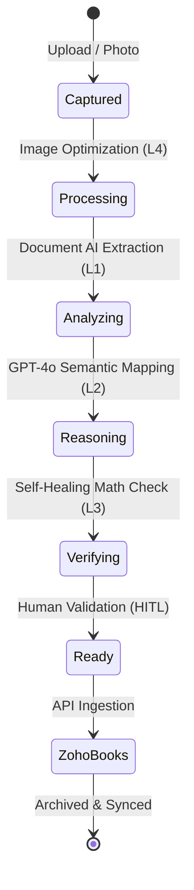
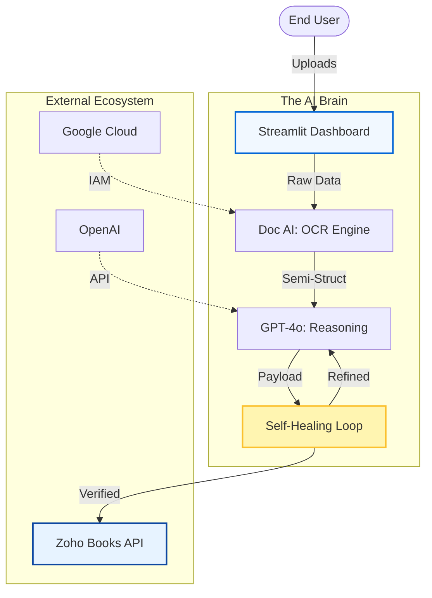

# 🫒 Olive Invoice Automation
> **The Intelligent Backbone for Enterprise Financial Workflows**

[](https://github.com/ujjwaltiwari01/olive-living-invoice-automation)
[](https://streamlit.io)
[](https://cloud.google.com/document-ai)

---

## 💎 The Manager's Lens: Why Olive?

> "Olive isn't just a tool; it's a financial engine that converts administrative friction into operational velocity."

### 🚀 Efficiency Comparison: Manual vs. Olive
| Metric | Manual Entry | Olive Automation | Outcome |
| :--- | :--- | :--- | :--- |
| **Speed** | 5-10 mins / invoice | < 45 seconds | **90% Faster** |
| **Accuracy** | 85-90% (Human error) | 99%+ (AI Verification) | **Total Precision** |
| **Cost** | High Labor Intensity | Automated Scalability | **Lower OPEX** |
| **Visibility** | Paper-based / Siloed | Real-time Dashboard | **Global Insight** |

---

## 🛤️ The Journey of an Invoice (Lifecycle)

Witness the transformation of a raw document into a verified financial record.



---

## 🏛️ System Blueprint (Data Architecture)

How the "Core Brain" interacts with cloud infrastructure and ERP systems.



---

## 🧬 Intelligence Layers: The "L1-L4" Framework

We don't just read text; we understand financial intent.

> [!IMPORTANT]
> **What is Self-Healing?**
> If the AI detects a math error (e.g., Total doesn't match Line Item sums), it triggers a "Re-read" command, sending the document back to the LLM with specific instructions to fix the discrepancy. This mimics a human bookkeeper's second look.

- **🎨 L4: Visual Clarity** – OpenCV-based enhancements make even blurry mobile photos "AI-readable."
- **🔍 L1: Extraction** – Google Cloud's industrial-grade OCR extracts base entities.
- **🧠 L2: Intelligence** – GPT-4o understands which GSTIN belongs to the vendor vs. Olive.
- **🛡️ L3: Reliability** – Custom logic ensures every rupee is accounted for before manual review.

---

## 📱 Features That Power Your Business

- **📸 Instant Capture**: Specifically tuned for mobile browser cameras.
- **📑 Bulk Processing**: Uploading 100+ invoices? The system queues them automatically.
- **🤖 Smart GST Mapping**: Deep understanding of SGST, CGST, IGST, and HSN codes.
- **👩‍💻 HITL Console**: Human-In-The-Loop interface for ultimate control.

---

## 🛠️ Technology Stack

| Component | Technology | Logo |
| :--- | :--- | :--- |
| **Frontend** | Streamlit | 🎈 |
| **Intelligence** | OpenAI GPT-4o | 🤖 |
| **OCR Infrastructure** | Google Document AI | ☁️ |
| **Business Logic** | Python 3.10+ | 🐍 |
| **ERP Target** | Zoho Books | 💼 |

---

## 🚀 Setup & Launch

> [!TIP]
> Use the `.env.template` (if available) to quickly configure your API keys.

1.  **Environment Sync**:
    ```bash
    pip install -r requirements.txt
    ```
2.  **Authentication**:
    Drop your Google Cloud `service-account.json` into the root.
3.  **Blast Off**:
    ```bash
    streamlit run main.py
    ```

---

## 📝 Use Case: The "Field Agent" Scenario
Imagine a site manager at an Olive Living property receiving a fresh supply invoice. They whip out their phone, snap a photo, and by the time they've walked back to their desk, the invoice is already verified and waiting in Zoho Books. **That is Olive Automation.**

---
*© 2024 Olive Living. All rights reserved.*
